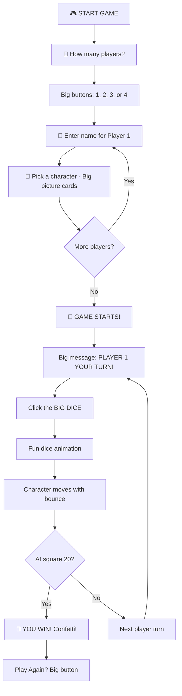
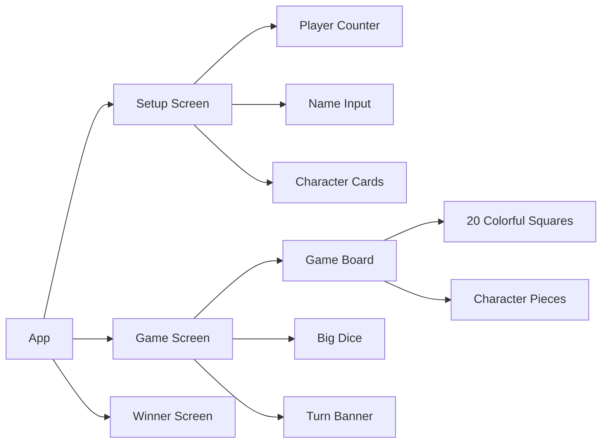

# TOMAS-DUNGEON Game - Kid-Friendly Implementation Plan

## Project Overview
A **simple, colorful, and fun** web-based board game designed for **little kids** (ages 4-8). Built with React + Node.js for easy local play with polished animations and bright, engaging visuals.

## Game Specifications
- **Name**: TOMAS-DUNGEON
- **Players**: 1-4 (local multiplayer on same device)
- **Board Squares**: 20
- **Characters**: Giant Squid, Cad, Milo the Dog
- **Win Condition**: First player to reach square 20
- **Target Audience**: Young children (4-8 years old)

## Kid-Friendly Design Principles

### 🎨 Visual Design
- **Bright, vibrant colors** (primary colors: red, blue, yellow, green)
- **Large, clear text** (minimum 24px font size)
- **Big buttons** (minimum 80px height for easy clicking/tapping)
- **Cute character illustrations** (friendly, cartoon-style)
- **Simple board layout** (clear path from start to finish)
- **High contrast** for easy visibility

### 🎮 Interaction Design
- **One-click actions** (no complex interactions)
- **Large click/touch targets** (60px minimum)
- **Immediate visual feedback** (animations on every action)
- **Clear turn indicators** (big arrow or highlight showing whose turn)
- **Simple instructions** (pictures + minimal text)
- **No reading required** (icons and colors guide gameplay)

### 🎵 Engagement Features
- **Fun sound effects** (optional, can be muted)
- **Celebration animations** (stars, confetti, bouncing)
- **Encouraging messages** ("Great roll!", "Your turn!", "You won!")
- **Smooth, playful animations** (bouncing, wiggling, spinning)

## Technology Stack
- **Frontend**: React 18+ with hooks
- **Styling**: CSS3 with keyframe animations
- **Build Tool**: Vite
- **Containerization**: Docker
- **Server**: Node.js with Express

## Game Flow (Simplified for Kids)



## Component Architecture (Simplified)



## Project Structure
```
tomas-dungeon/
├── client/
│   ├── public/
│   │   ├── assets/
│   │   │   ├── characters/      # Cute character images
│   │   │   ├── sounds/          # Fun sound effects (optional)
│   │   │   └── icons/           # Simple icons
│   ├── src/
│   │   ├── components/
│   │   │   ├── SetupScreen.jsx       # Simple setup
│   │   │   ├── GameBoard.jsx         # Colorful board
│   │   │   ├── BigDice.jsx           # Large, clickable dice
│   │   │   ├── CharacterPiece.jsx    # Cute characters
│   │   │   ├── TurnBanner.jsx        # Clear turn indicator
│   │   │   ├── WinnerScreen.jsx      # Celebration screen
│   │   │   └── CharacterCard.jsx     # Character selection
│   │   ├── hooks/
│   │   │   └── useGameState.js
│   │   ├── styles/
│   │   │   ├── App.css               # Global kid-friendly styles
│   │   │   ├── GameBoard.css         # Bright board colors
│   │   │   ├── Dice.css              # Fun dice animations
│   │   │   └── animations.css        # Playful animations
│   │   ├── App.jsx
│   │   └── main.jsx
│   ├── package.json
│   └── vite.config.js
├── server/
│   ├── server.js
│   └── package.json
├── Dockerfile
├── docker-compose.yml
└── README.md
```

## Kid-Friendly Features

### 1. Setup Screen (Super Simple!)
- **Big number buttons**: "How many players?" with huge 1, 2, 3, 4 buttons
- **Simple name input**: Large text box with placeholder "Type your name"
- **Character cards**: Big picture cards to click (no dropdown menus)
- **Visual feedback**: Selected card glows/bounces
- **Start button**: Huge "START GAME!" button

### 2. Game Board (Colorful & Clear)
- **Rainbow path**: Each square a different bright color
- **Large squares**: 80px x 80px minimum
- **Clear numbering**: Big numbers 1-20 on each square
- **Start square**: Special "START" with arrow
- **Goal square**: Special "FINISH" with trophy/flag
- **Simple layout**: Winding path or straight line (easy to follow)

### 3. Big Dice (Easy to Use)
- **Huge size**: 150px x 150px
- **Clear dots**: Large, high-contrast dots
- **Pulsing animation**: "Click me!" effect when it's your turn
- **Fun roll**: Tumbling animation with sound
- **Big result**: Shows number clearly after roll

### 4. Character Pieces (Cute & Animated)
- **Large sprites**: 60px x 60px minimum
- **Bouncing movement**: Fun hop animation when moving
- **Distinct colors**: Each player has a bright color
- **Friendly designs**: Cartoon-style, smiling characters
- **Clear visibility**: Always on top of squares

### 5. Turn System (Crystal Clear)
- **Big banner**: "PLAYER 1 - YOUR TURN!" at top of screen
- **Flashing arrow**: Points to current player
- **Color coding**: Banner matches player color
- **Disable others**: Only active player can click dice
- **Sound cue**: Optional "ding" when turn changes

### 6. Win Screen (Super Exciting!)
- **Full screen celebration**: Takes over entire screen
- **Confetti animation**: Colorful confetti falling
- **Big message**: "PLAYER 1 WINS!" in huge letters
- **Winner character**: Bouncing/dancing animation
- **Play again button**: Huge "PLAY AGAIN!" button

## Animation Details (Fun & Playful)

### Dice Roll
- **Duration**: 1 second (not too fast, not too slow)
- **Effect**: 3D tumbling with bounce at end
- **Sound**: Optional rolling sound + "ding" on result

### Character Movement
- **Duration**: 0.5 seconds per square
- **Effect**: Bouncing hop from square to square
- **Trail**: Optional sparkle trail behind character
- **Sound**: Optional "boing" sound per hop

### Turn Change
- **Duration**: 0.5 seconds
- **Effect**: Banner slides in with bounce
- **Highlight**: Current player glows/pulses

### Win Celebration
- **Duration**: 3 seconds
- **Effects**: 
  - Confetti falling from top
  - Winner character grows and bounces
  - Stars spinning around winner
  - Rainbow background pulse

## Color Palette (Bright & Cheerful)
```css
--primary-red: #FF4444
--primary-blue: #4444FF
--primary-yellow: #FFDD44
--primary-green: #44FF44
--bright-orange: #FF8844
--bright-purple: #BB44FF
--bright-pink: #FF44BB
--white: #FFFFFF
--dark-text: #333333
```

## Accessibility for Kids
- **No small text**: Minimum 20px, prefer 24-32px
- **High contrast**: Dark text on light backgrounds
- **Touch-friendly**: All buttons 60px+ height
- **No hover-only**: Works on tablets/touch screens
- **Simple language**: Short words, simple sentences
- **Visual icons**: Pictures alongside text
- **Forgiving input**: Accept any name, no validation errors

## Docker Configuration
- Lightweight Node.js Alpine image
- Port 3000 exposed
- Easy one-command startup
- Volume mounting for development

## Implementation Phases

### Phase 1: Foundation
- Set up React + Vite project structure
- Create basic game state management
- Set up color palette and global styles

### Phase 2: Setup Screen
- Build player number selector (big buttons)
- Create name input screen (large, simple)
- Design character selection cards (big pictures)
- Add start game button

### Phase 3: Game Board
- Create 20-square colorful board
- Add start and finish markers
- Implement character pieces
- Add turn banner

### Phase 4: Game Mechanics
- Build big, clickable dice
- Implement dice roll animation
- Add character movement with bounce
- Create turn progression logic

### Phase 5: Polish & Fun
- Add win detection and celebration screen
- Implement all playful animations
- Add optional sound effects
- Test with focus on kid-friendliness

### Phase 6: Deployment
- Create Docker configuration
- Write simple README
- Final testing for ease of use

## Success Criteria
✅ A 5-year-old can play without help  
✅ All interactions are one-click/tap  
✅ Bright, engaging visuals  
✅ Clear whose turn it is at all times  
✅ Fun animations keep kids engaged  
✅ No confusing menus or options  
✅ Works on tablets and computers  
✅ Easy for parents to set up and run  

## Next Steps
Ready to proceed with implementation in Code mode!